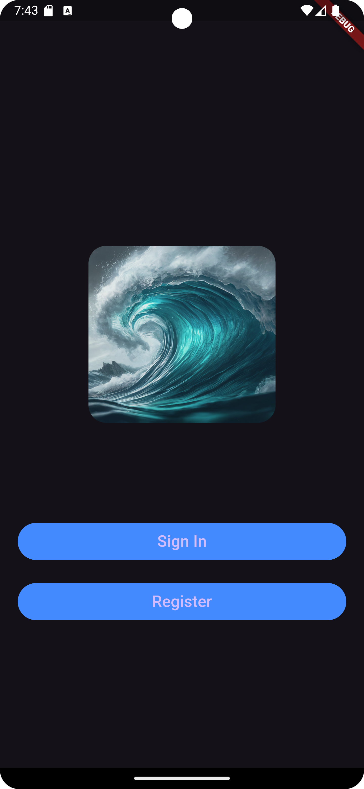
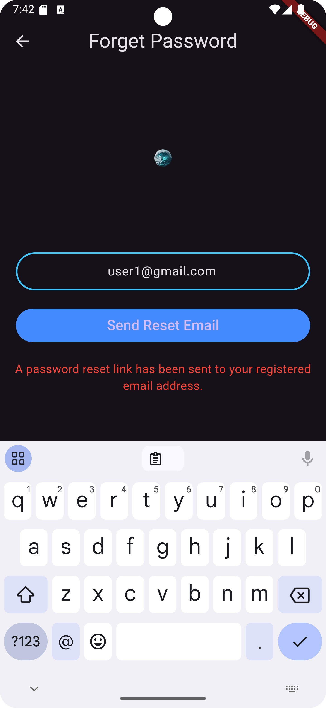
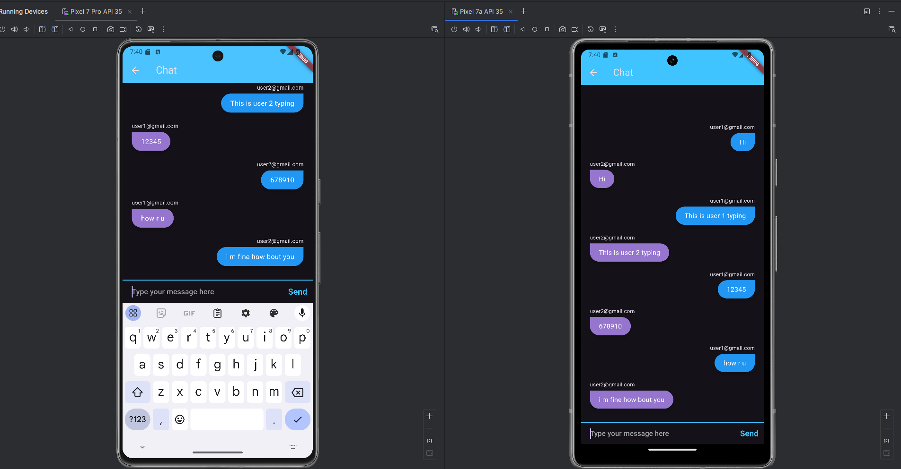

# Mobile Chat App
This is a real time mobile chat app built using Flutter and Firebase.
Users can register and sign in to his/her account and chat.

## Welcome Page
User can choose to sign in or register for an account here.

## Register Page
User can register an account using E-mail and Password.

## Forget Password
If a user forgets his/her password, they can request for a link to reset their password. The reset link will be sent to their registered email.

## Chat 
Here is a screenshot of two users messaging each other.

